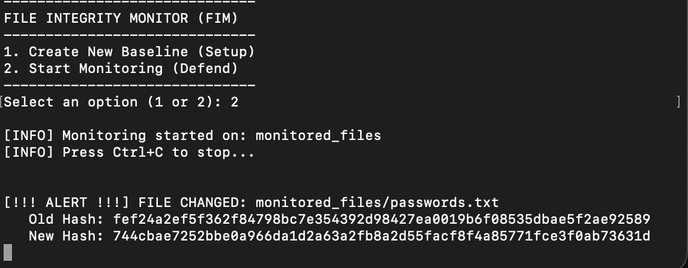

# File Integrity Monitor (FIM) 

A lightweight, Python-based cybersecurity tool that monitors file integrity in real-time. It calculates SHA-256 hashes of files to create a baseline and alerts the user if any file is modified, deleted, or created.

##  Features
- **SHA-256 Hashing:** Uses secure hashing algorithms to verify file integrity.
- **Baseline Creation:** Scans a target directory to create a "known-good" state.
- **Real-Time Monitoring:** Continuously checks for changes against the baseline.
- **Instant Alerts:** Notifies the user immediately upon detection of:
  - File Modifications 
  - New File Creations 
  - File Deletions
  - 
##  Installation

* Clone the repository:
```bash
git clone [https://github.com/sedat4ras/hash-based-change-detector.git](https://github.com/sedat4ras/hash-based-change-detector.git)
cd hash-based-change-detector
```
* Create a folder to moonitor:
```
mkdir monitored_files
```
## Usage: 
To ensure the tool is working correctly, follow these steps to create a baseline and simulate an integrity breach.

**1-) Setup the Environment** 
First, ensure you are in the project directory and your virtual environment is active:

```
source venv/bin/activate  # On macOS/Linux
# or
.\venv\Scripts\activate   # On Windows
```

**2-) Create a Baseline (This base line will be the "Good" state of your file**
Run the script and select Option 1. This option generates a baseline.txt file containing the original SHA-256 hashes of your files.

```
python3 main.py
# Select Option 1
```
**3-) Start Monitoring**
After creating the baseline, you need to restart the script or stay in the menu to initiate the protector. Choose Option 2 to enter the real-time monitoring loop.

```
python3 main.py
# Type '2' and press Enter
```

Once selected, the tool will enter a continuous loop, scanning the monitored_files directory every second. You will see a message like "Monitoring files..." indicating the guard is active. Do not close this terminal window, as it is now your active security monitor.

**4-) Simulate an Attack**
Open a second terminal window, navigate to the project folder, and modify a file to trigger an alert:

```
echo "Unauthorized change" > monitored_files/passwords.txt
```

**Verify the Alert**
Go back to your first terminal. You should see a high-visibility alert: 
[!!! ALERT !!!] FILE CHANGED: monitored_files/passwords.txt

